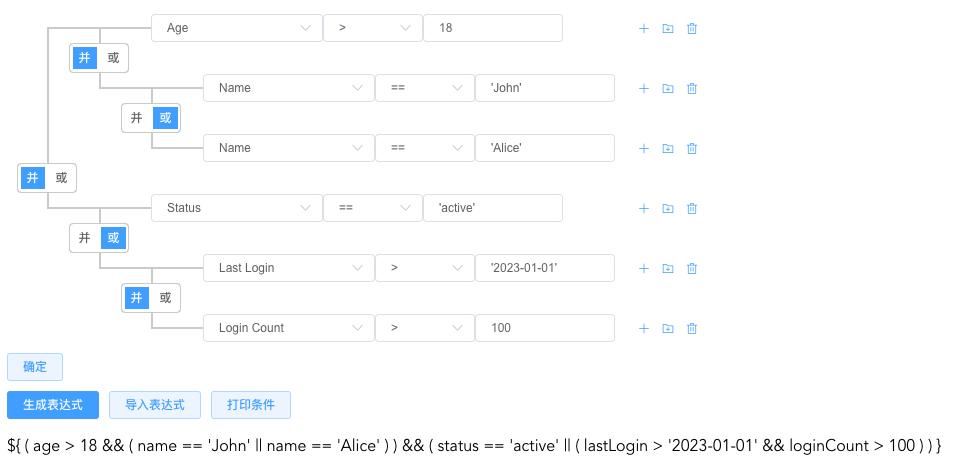

# Vue2 + JS + Webpack For JUEL expression generation

Vue2Juel

> A JUEL expression generation component that supports Vue 2



<p align='center'>
<b>English</b> | <a href="https://github.com/tudan110/vue2-juel/blob/main/README.zh-CN.md">简体中文</a>
</p>

## Features

- Provides a library mode development environment for Vue 2
- Adapts scripts in package.json for publishing

## Using the Template

To directly use this template, please run the following command:

```bash
npx degit tudan110/vue2-juel my-component
```

And replace vue2-juel and Vue2Juel globally with the name of your component library.

## Installation

Make sure to install the dependencies first:

```bash
# sh
npm install
```

## Development

Start the development server:

```sh
npm run dev
```

## Build

Build the library for production or publishing:

```sh
npm run lib
```

Build the example project for production or publishing:

```sh
npm run build
```

## Check and Fix Files
```
npm run lint
```

## Publish Package to npm

Log in to the npm registry
```sh
npm login
```

Publish
```sh
npm publish --access public
```

## How to Use the lib File?

### npm Installation

```sh
npm i vue2-juel
```

### Global Import
Import and register the component in main.js
```js
import Vue from 'vue'
import Vue2Juel from 'vue2-juel'

Vue.use(Vue2Juel)
```

### Manual Import
```js
import Vue2Juel from 'vue2-juel'

export default {
    components: {
        Vue2Juel
    }
}
```

### Without a Build Tool or via `CDN`

```html
<!DOCTYPE html>
<html lang="en">
<head>
    <meta charset="UTF-8" />
    <link rel="icon" href="/favicon.ico" />
    <meta name="viewport" content="width=device-width, initial-scale=1.0" />
    <title>Vite App</title>
    <script src="https://cdn.jsdelivr.net/npm/vue@2"></script>
    <!-- Make sure you have this file in your current directory -->
    <script src="/lib/vue2-juel.umd.js"></script>
    <style>
        #app {
            font-family: Avenir, Helvetica, Arial, sans-serif;
            -webkit-font-smoothing: antialiased;
            -moz-osx-font-smoothing: grayscale;
            text-align: center;
            color: #2c3e50;
            margin-top: 60px;
        }
    </style>
</head>
<body>
<div id="app">
    <vue2-juel></vue2-juel>
</div>
</body>
<script>
    var app = new Vue({
        el: '#app'
    })
</script>
</html>
```

## License

Made with ❤️

Published under [MIT License](./LICENSE).
